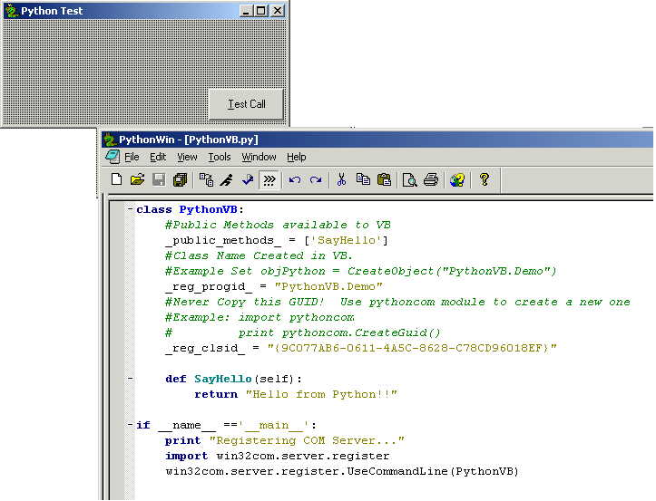



## Interface Visual Basic with the Python Scripting Language

### Description

If you have never heard of, or used the Python Scripting Language you may want to now. This example shows how to call Python Scripts from Visual Basic using COM. This is a simple example but will get you started. Python is a cross platform scripting language with an easy to use syntax (similar to VB). Its completely object oriented and used by some very powerful companies. ie NASA, Google, Infoseek, etc. To get this example running please read the instructions.txt fine included in the zip.
 
### More Info
 

             |
---                |---
**Submitted On**   |2000-06-23 13:08:16
**By**             |[fishoutawata](https://github.com/Planet-Source-Code/PSCIndex/blob/master/ByAuthor/fishoutawata.md)
**Level**          |Intermediate
**User Rating**    |5.0 (25 globes from 5 users)
**Compatibility**  |VB 5\.0, VB 6\.0
**Category**       |[OLE/ COM/ DCOM/ Active\-X](https://github.com/Planet-Source-Code/PSCIndex/blob/master/ByCategory/ole-com-dcom-active-x__1-29.md)
**World**          |[Visual Basic](https://github.com/Planet-Source-Code/PSCIndex/blob/master/ByWorld/visual-basic.md)
**Archive File**   |[CODE\_UPLOAD70406232000\.zip](https://github.com/Planet-Source-Code/fishoutawata-interface-visual-basic-with-the-python-scripting-language__1-9169/archive/master.zip)

